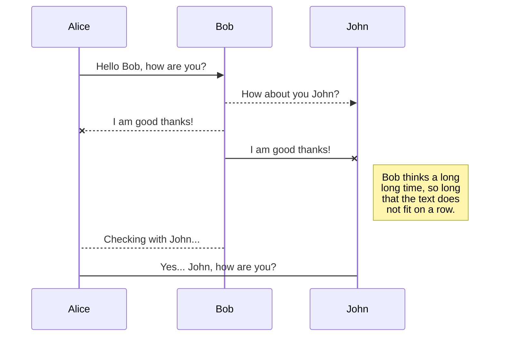
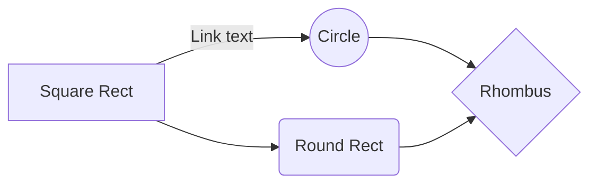

## UML 2.0

1. UML
   1. What is UML
      1. Unified Modeling Language
      2. A graphical way of describing software systems
   2. Use Case
   3. Activity Diagram
   4. Class Diagram
   5. Sequence Diagram
2.

You can render UML diagrams using [Mermaid](https://mermaidjs.github.io/). For example, this will produce a sequence diagram:

And this will produce a flow chart:

### Refernce
1. [UML 2.0 Tutorial - youtube](https://www.youtube.com/watch?v=OkC7HKtiZC0&list=PLGLfVvz_LVvQ5G-LdJ8RLqe-ndo7QITYc)
2.
